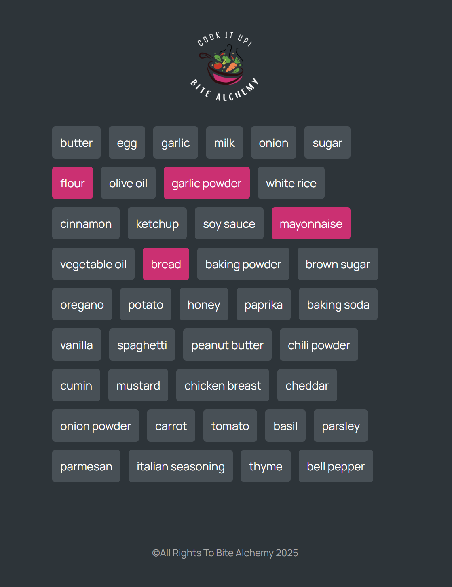

# 🍽️ Bite Alchemy

Discover the perfect recipe by simply entering the ingredients you have at home. Let the magic of smart cooking inspire your next meal!

## 🚀 Live Demo

[Bite Alchemy Live](https://bite-alchemy.vercel.app/)

## 🌟 Features

- 🔍 Search recipes by available ingredients
- 🥗 Get instant suggestions for creative meals using the **Spoonacular API**
- 📋 Easy-to-follow recipe instructions
- 🌐 Responsive design for all devices
- 🚧 **In Development** — Exciting new features coming soon!

## 🛠️ Built With

- **React** — for dynamic UI
- **JavaScript** — for logic and interactivity
- **CSS** — for styling
- **Spoonacular API** — for fetching recipes and ingredients data

## 📦 Installation

1. Clone the repository:
   ```bash
   git clone https://github.com/mahla-kh/Bite-Alchemy.git
   ```
2. Navigate to the project directory:
   ```bash
   cd Bite-Alchemy
   ```
3. Install dependencies:
   ```bash
   npm install
   ```
4. Run the app:
   ```bash
   npm run dev
   ```

## 📸 Screenshots




## 📬 Contact

Feel free to reach out via [GitHub](https://github.com/mahla-kh) !

---

⭐️ *If you like this project, give it a star!*

